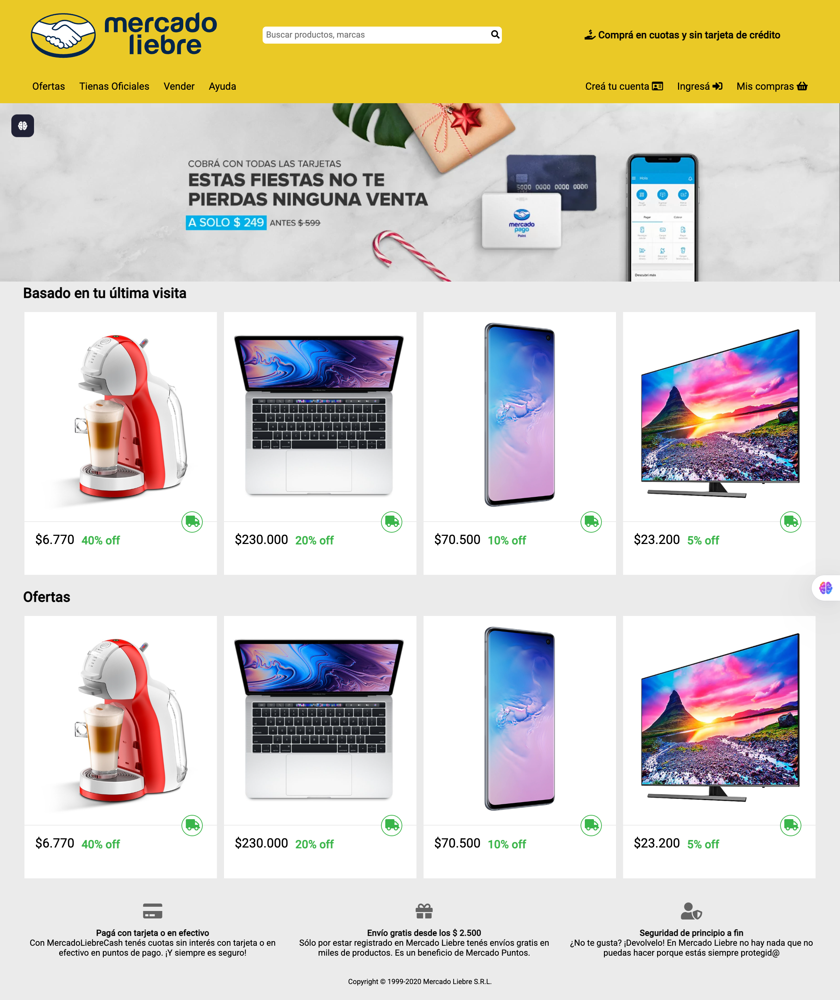

# Mercado Liebre



Mercado Liebre is a mock e-commerce web project inspired by Mercado Libre. It demonstrates the basic structure and functionality of an online store, including product listings, pricing, user registration, and login pages.

## Features

-   **Home Page**: View featured products, offers, and product details such as images, prices, and discounts.
-   **Product Listings**: Products are displayed with images, names, prices, discounts, and delivery icons.
-   **User Registration**: Users can register by providing personal information, selecting interests, and uploading a profile picture.
-   **User Login**: Registered users can log in with their username and password.
-   **Responsive Design**: The site is styled with CSS and adapts to different screen sizes.
-   **Navigation**: Includes navigation bars for offers, official stores, selling, help, and user account actions.

## Project Structure

```
├── app.js
├── package.json
├── Procfile
├── public/
│   ├── css/
│   │   ├── normalize.css
│   │   └── styles.css
│   └── images/
│       └── ... (product and logo images)
└── views/
    ├── home.html
    ├── login.html
    └── register.html
```

## How to Run

1. **Install dependencies**

    ```
    npm install
    ```

2. **Start the server**
    ```
    node app.js
    ```
    The app will run on [http://localhost:3000](http://localhost:3000) by default.

## Pages

-   **Home** (`/`): Displays product sections "Basado en tu última visita" and "Ofertas" with product cards.
-   **Register** (`/register`): Registration form for new users, including personal info, interests, and profile picture upload.
-   **Login** (`/login`): Login form for existing users.

## Technologies Used

-   Node.js
-   Express.js
-   HTML5 & CSS3 (with normalize.css and custom styles.css)
-   Font Awesome for icons
-   Google Fonts (Roboto)

## License

This project is for educational purposes only.
